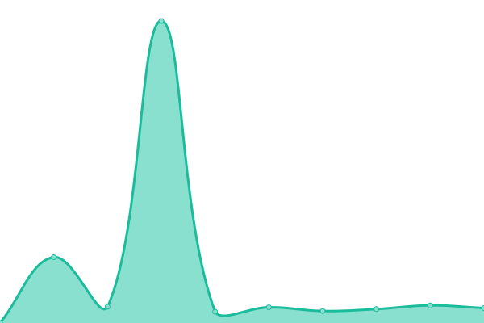

# [📈 Live Status](https:///upptime): <!--live status--> **🟧 Partial outage**

This repository contains the open-source uptime monitor and status page for [minitomate](https:///upptime), powered by [Upptime](https://github.com/upptime/upptime).

With [Upptime](https://upptime.js.org), you can get your own unlimited and free uptime monitor and status page, powered entirely by a GitHub repository. We use [Issues](https://github.com/minitomate/upptime/issues) as incident reports, [Actions](https://github.com/minitomate/upptime/actions) as uptime monitors, and [Pages](https:///upptime) for the status page.

<!--start: status pages-->
<!-- This summary is generated by Upptime (https://github.com/upptime/upptime) -->
<!-- Do not edit this manually, your changes will be overwritten -->
<!-- prettier-ignore -->
| URL | Status | History | Response Time | Uptime |
| --- | ------ | ------- | ------------- | ------ |
|  [Mini tomate](https://minitomate.com) | 🟩 Up | [mini-tomate.yml](https://github.com/Minitomate/upptime/commits/HEAD/history/mini-tomate.yml) | 

 835ms
     
 | 

<a href="https://minitomate.github.io/upptime/history/mini-tomate">99.83%</a>
    

|  [Kipad Animation](https://kipad.net/) | 🟥 Down | [kipad-animation.yml](https://github.com/Minitomate/upptime/commits/HEAD/history/kipad-animation.yml) | 

 117ms
     
 | 

<a href="https://minitomate.github.io/upptime/history/kipad-animation">0.00%</a>
    

<!--end: status pages-->

[**Visit our status website →**](https:///upptime)

## 📄 License

- Powered by: [Upptime](https://github.com/upptime/upptime)
- Code: [MIT](./LICENSE) © [Anand Chowdhary](https://anandchowdhary.com), supported by [Pabio](https://pabio.com)
- Data in the `./history` directory: [Open Database License](https://opendatacommons.org/licenses/odbl/1-0/)
